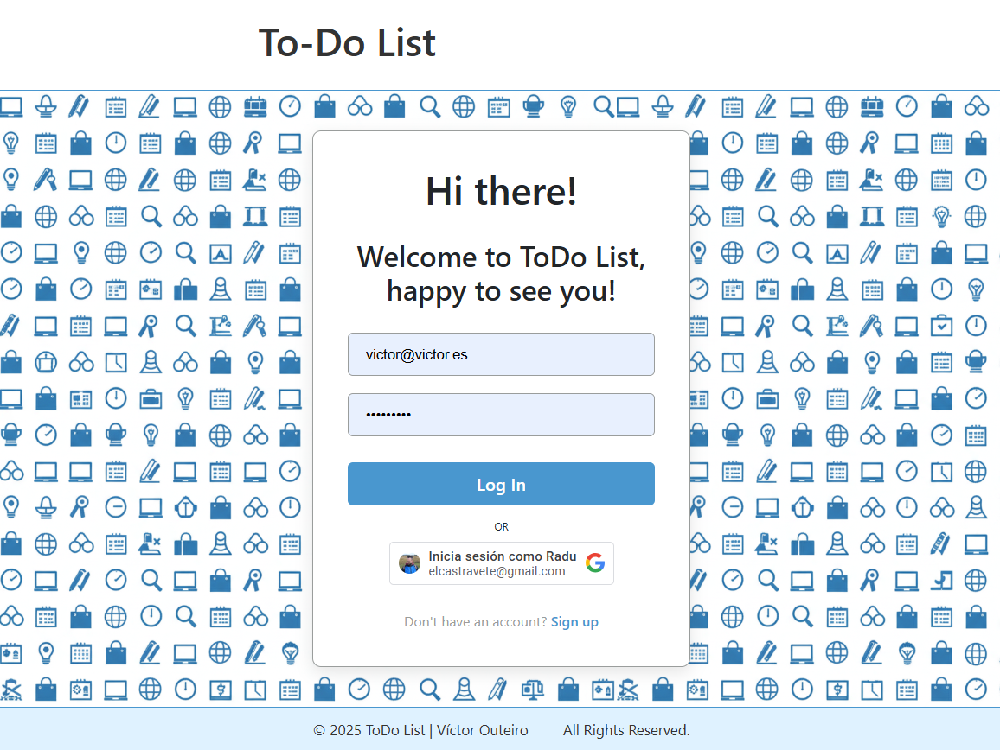

# 📝 ToDo List - My Day

A modern daily task management app built with **HTML, CSS, and JavaScript, fully connected to a Node.js, Express, and MongoDB backend**.
It lets you create, edit, complete, delete, and reorder tasks while filtering between pending and completed ones.
Includes user **authentication (email and Google) and secure data persistence using JWT**.

## Live Demo

🚀 The app is fully deployed and functional:
👉 https://todo-front-mu.vercel.app/

## 📸 Screenshots

Add your screenshots or demo GIFs here:

🧭 Main App (ToDo / Done):

🔐 Login Screen:

## Table of Contents

1. [Features](#features)
2. [Technologies](#technologies)
3. [What I Learned](#what-i-learned)
4. [Future Improvements](#future-improvements)
5. [Acknowledgments](#acknowledgments)
6. [Links](#links)

---

## Features

### Core Features

✅ Create new tasks.

✏️ Edit task names by clicking on them.

🔄 Toggle status between pending ↔ completed.

🗑️ Delete tasks with smooth animations.

🔍 Filter by all, pending, or completed.

🎨 CSS animations for adding and removing tasks.

### Backend Integration

💾 Data persistence in MongoDB through a hosted REST API (Render).

⚙️ Full CRUD operations.

🔑 Login and registration via email or Google OAuth.

🔒 Secure sessions managed with JSON Web Tokens (JWT).

🧲 Drag & Drop reordering of tasks using SortableJS.

## Technologies

### Frontend

HTML5 → semantic structure

CSS3 → variables, transitions, and responsive design

Vanilla JavaScript (ES6+) → logic, events, and DOM manipulation

SortableJS → intuitive drag & drop with backend synchronization

LocalStorage + JWT → secure session and token handling

### Backend (integration)

Node.js + Express

MongoDB / Mongoose

JWT for authentication

Hosting on Vercel for the front-end and on Koyeb for the back-end

## What I Learned

This project helped me strengthen my skills in:

✅ Frontend–backend integration using secure fetch requests and REST endpoints.

🧩 Drag & drop mechanics with SortableJS and backend synchronization.

🧠 Dynamic DOM manipulation with optimistic re-rendering.

🔐 User authentication with secure JWT handling and localStorage.

🎨 CSS animations coordinated with JavaScript events (animationend, click, keydown, etc.).

## Future Improvements

🌙 Dark/Light theme switch.

🗂️ Quick search for tasks.

📱 Enhanced mobile UI.

🔔 Task reminders or notifications.

🌐 Internationalization (i18n) for multilingual support.

## Acknowledgments

Special thanks to **Inma Contreras**, my instructor from the Certificado de Profesionalidad IFCD0210 – Desarrollo de Aplicaciones con Tecnologías Web,
for her guidance, inspiration, and constant encouragement throughout the learning process.

I also want to thank my classmates for their collaboration, feedback, and support during the development of this project — your ideas and teamwork made this app much better. 🙌

## Links

🌍 Live App: https://todo-front-mu.vercel.app/

💻 GitHub Repository: https://github.com/Radu-A/todo-front

👤 My GitHub Profile: https://github.com/Radu-A

💼 LinkedIn: https://www.linkedin.com/in/victor-outeiro/
